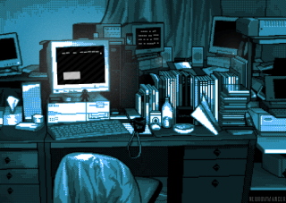

### Saudações. 👋 
Meu nome é Carlos e seja bem-vindo ao meu repositório do GitHub. 
Sinta-se a vontade para explorar meu trabalho.

  

  

   
   
  

    
    
  

<!--
**CarlosBotelhoCHB/CarlosBotelhoCHB** is a ✨ _special_ ✨ repository because its `README.md` (this file) appears on your GitHub profile.

Here are some ideas to get you started:

- 🔭 I’m currently working on ...
- 🌱 I’m currently learning ...
- 👯 I’m looking to collaborate on ...
- 🤔 I’m looking for help with ...
- 💬 Ask me about ...
- 📫 How to reach me: ...
- 😄 Pronouns: ...
- ⚡ Fun fact: ...
-->
